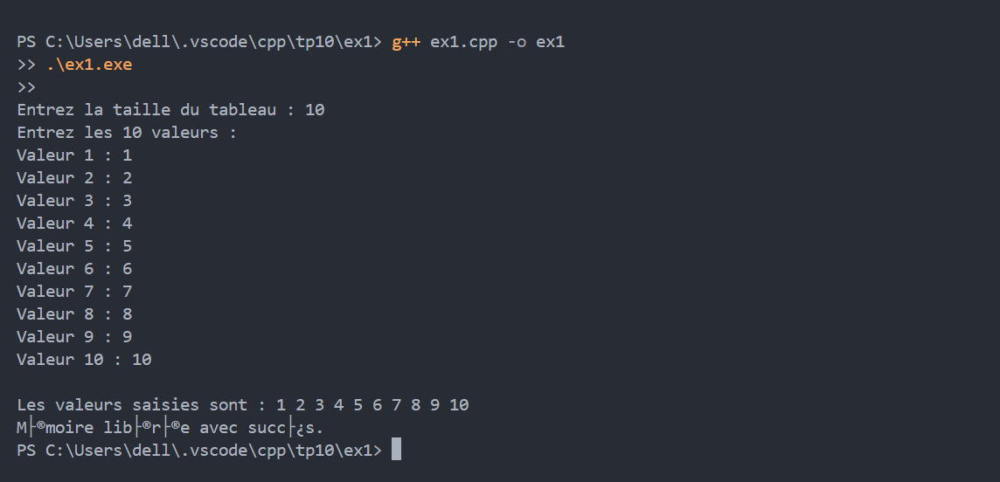
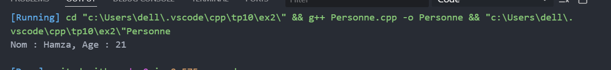
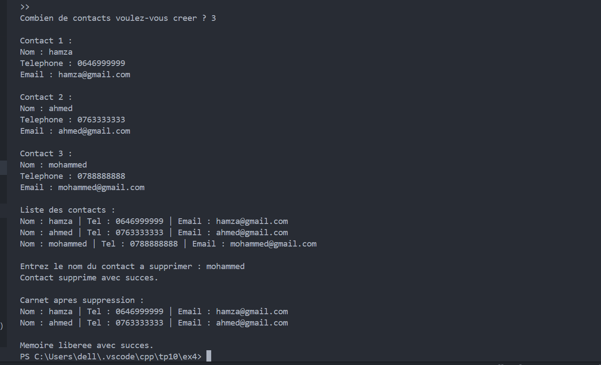

# TP10 : Gestion dynamique de la mémoire et pointeurs

## Exercice 1 : Tableau d’entiers dynamique  
Création, saisie, affichage et suppression d’un tableau dynamique.  
**Capture :**  

## Exercice 2 : Objet dynamique Personne  
Création dynamique d’un objet avec nom et âge, affichage, puis suppression.  
**Capture :**  

## Exercice 3 : Tableau dynamique d’objets Livre  
Saisie et affichage d’un tableau dynamique d’objets Livre.  
**Capture :**  

## Exercice 4 : Carnet d’adresses dynamique  
Ajout, affichage, suppression de contacts dans un carnet dynamique.  
**Capture :**  

